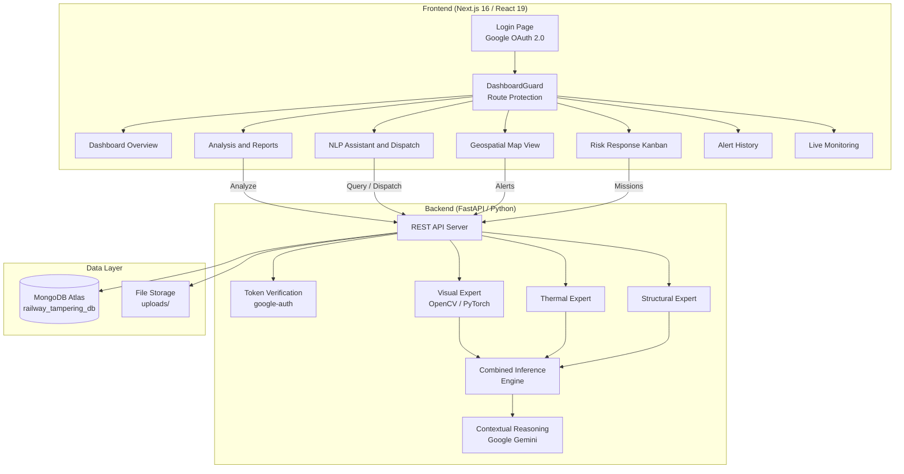
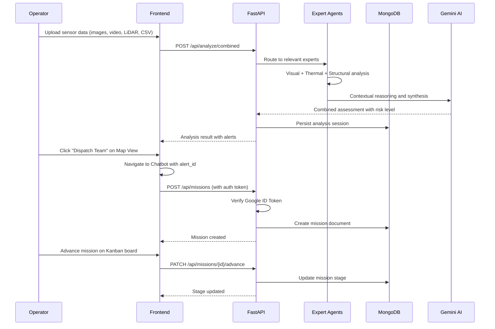
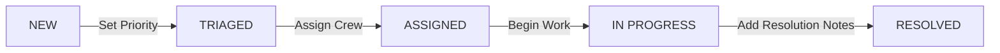
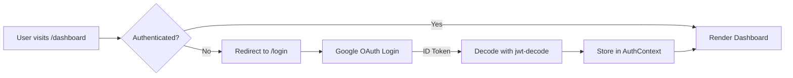
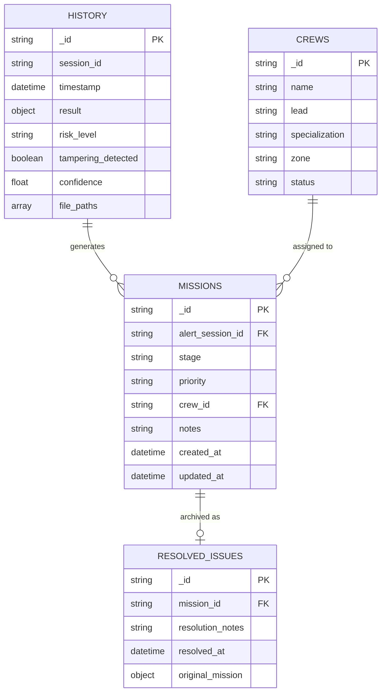

# Railway Tampering and Anomaly Detection System


## Overview

A production-grade **Mixture-of-Experts (MoE)** system for real-time detection of railway track anomalies and intentional tampering across large rail networks. The platform fuses structural, visual, thermal, and contextual sensor evidence through independent expert agents, performs geo-referenced anomaly analysis, and generates actionable operational outputs including real-time alerts, incident reports, and automated dispatch workflows.

Built for the **Ministry of Railways, Government of India**.

---

## System Architecture



---

## Data Flow: Detection to Resolution



---

## Modules

### 1. Dashboard Overview

Central command view displaying aggregated KPIs, real-time alert counts, severity distribution charts, and recent analysis history. Provides at-a-glance situational awareness for operators.

### 2. Analysis and Reports

Multi-modal file upload interface supporting images, video, LiDAR point clouds, and CSV sensor data. The Mixture-of-Experts engine runs all applicable expert agents and produces:

- Tampering confidence scores and evidence chains
- Severity classification (Tier 1-4)
- AI-generated remedial action plans
- Professional Government-standard PDF reports with visual evidence, heatmaps, and time-series charts
- One-click "Route to Risk Team" button to auto-create a mission and redirect to the Kanban board

All analysis results are persisted to MongoDB for historical review.

### 3. NLP Assistant and Dispatch (Planning and Logistics)

Dual-purpose module combining a natural language chatbot (powered by Google Gemini) with an operational dispatch panel:

- **Chat Tab**: Context-aware AI assistant for querying analysis results and operational guidance
- **Planning Tab**: Real-time stats (active alerts, missions, crews), alert selection, crew roster from MongoDB, equipment checklists by alert type, and a dispatch action that creates a new mission

Supports deep linking from the Map View via `?alert_id=` query parameter for seamless context transfer.

### 4. Geospatial Map View (Hotspot Visualization)

Interactive map built with React-Leaflet and OpenStreetMap (CartoDB Dark Matter tiles):

- 12 zones mapped to real coordinates across the Delhi-NCR railway corridor
- Severity-coded circular markers (green, yellow, orange, red)
- Click-to-inspect: zone popups and side panel with specific alerts
- Direct dispatch links from individual alert cards to the Planning module

### 5. Risk Response (Kanban Board)

5-stage mission lifecycle management:



- Unrouted alerts from the database auto-populate the "New" column as virtual cards
- Moving an alert from "New" auto-creates a persistent mission in MongoDB
- Crew assignment dropdown sourced from the `crews` collection
- Resolved missions are archived to a dedicated `resolved_issues` collection

### 6. Alert History

Chronological log of all past analysis sessions, sortable and filterable by severity, type, and date. Enables audit trails and trend analysis.

### 7. Live Monitoring

Real-time sensor status dashboard with WebSocket-powered alert streaming.

---

## Authentication and Security

### Frontend Route Protection



- **Google OAuth 2.0** integration via `@react-oauth/google`
- **AuthContext** manages session state and token lifecycle
- **DashboardGuard** component wraps all `/dashboard/*` routes
- Mock login available for development and demonstration

### Backend API Security

- All write endpoints (`POST /api/missions`, `PATCH /api/missions/*/advance`, `PATCH /api/missions/*/resolve`, `PATCH /api/crews/*/status`) require a valid Google ID Token in the `Authorization: Bearer <token>` header
- Token verification using the `google-auth` library with Google's public key infrastructure
- Read endpoints remain open for operational flexibility

---

## Expert Agents

| Agent | Input Types | Detection Capabilities |
|-------|-------------|----------------------|
| Visual Integrity Expert | Images, Video (CCTV, Drone) | Component displacement, foreign objects, rail cutting, human activity |
| Thermal Anomaly Expert | Thermal imagery, LiDAR | Thermal hotspots, structural fatigue signatures, point cloud deviations |
| Track Structural Expert | CSV (accelerometer, geometric) | Vibration anomalies, gauge deviations, ballast disturbance |
| Contextual Reasoning (Gemini) | All expert outputs | Cross-modal correlation, natural language synthesis, action planning |
| Combined Inference Engine | All modalities | Unified risk scoring, confidence aggregation, alert generation |

---

## API Endpoints

### Core Analysis

| Method | Endpoint | Description |
|--------|----------|-------------|
| GET | `/api/health` | Health check and expert availability |
| POST | `/api/analyze/visual` | Visual tampering analysis |
| POST | `/api/analyze/lidar` | LiDAR/Thermal analysis |
| POST | `/api/analyze/vibration` | Vibration/Structural analysis |
| POST | `/api/analyze/combined` | Multi-expert combined analysis |
| POST | `/api/query` | Natural language query (Gemini) |
| GET | `/api/history` | Analysis session history |
| GET | `/api/alerts` | Active alerts |

### Crews and Missions (Authenticated)

| Method | Endpoint | Auth | Description |
|--------|----------|------|-------------|
| GET | `/api/crews` | No | List maintenance crews |
| PATCH | `/api/crews/{id}/status` | Yes | Update crew availability |
| GET | `/api/missions` | No | List missions (filterable by stage) |
| POST | `/api/missions` | Yes | Create mission from alert session |
| PATCH | `/api/missions/{id}/advance` | Yes | Advance mission to next stage |
| PATCH | `/api/missions/{id}/resolve` | Yes | Resolve mission with notes |

---

## Tech Stack

### Frontend

| Technology | Purpose |
|-----------|---------|
| Next.js 16 | React framework with App Router |
| React 19 | UI component library |
| TypeScript | Type safety |
| Tailwind CSS 4 | Utility-first styling |
| React-Leaflet | Interactive geospatial maps |
| Recharts | Dashboard charts and visualizations |
| Axios | HTTP client with auth interceptor |
| jwt-decode | Google ID Token parsing |
| jsPDF / html2canvas | PDF report generation |

### Backend

| Technology | Purpose |
|-----------|---------|
| FastAPI | Async REST API framework |
| Python 3.9+ | Core language |
| PyTorch | Deep learning inference |
| OpenCV | Image and video processing |
| Google Gemini | Contextual reasoning and NLP |
| google-auth | OAuth2 ID Token verification |
| MongoDB Atlas (PyMongo) | Persistent data storage |
| Matplotlib / Seaborn | Chart generation for reports |

---

## Database Schema



---

## Getting Started

### Prerequisites

- Node.js 18+
- Python 3.9+
- MongoDB Atlas account (or local MongoDB instance)
- Google Cloud Console project with OAuth 2.0 Client ID

### Installation

1. **Clone the repository**
    ```bash
    git clone https://github.com/nahmahn/Railway_tampering.git
    cd Railway_tampering
    ```

2. **Backend setup**
    ```bash
    pip install -r requirements.txt
    ```

3. **Configure environment variables**

    Create a `.env` file in the project root:
    ```env
    MONGO_URI=mongodb+srv://<user>:<pass>@<cluster>.mongodb.net/railway_tampering_db
    GEMINI_API_KEY=<your-gemini-api-key>
    ```

    Create `frontend/.env.local`:
    ```env
    NEXT_PUBLIC_GEMINI_API_KEY=<your-gemini-api-key>
    ```

4. **Frontend setup**
    ```bash
    cd frontend
    npm install
    ```

### Running the Application

1. **Start the backend**
    ```bash
    python api_server.py
    ```
    The API server starts at `http://localhost:8000`. API docs available at `http://localhost:8000/docs`.

2. **Start the frontend**
    ```bash
    cd frontend
    npm run dev
    ```
    The application opens at `http://localhost:3000`.

---

## Project Structure

```
Railway_tampering/
├── api_server.py              # FastAPI server with all endpoints
├── experts/
│   ├── visual_integrity_expert.py
│   ├── thermal_anomaly_expert.py
│   ├── track_structural_expert.py
│   ├── combined_inference.py
│   └── contextual_reasoning_expert.py
├── frontend/
│   ├── app/
│   │   ├── login/page.tsx           # Google OAuth login
│   │   └── dashboard/
│   │       ├── layout.tsx           # Protected layout with DashboardGuard
│   │       ├── overview/page.tsx    # Dashboard KPIs
│   │       ├── analysis/page.tsx    # Multi-modal analysis
│   │       ├── chatbot/page.tsx     # NLP Assistant + Dispatch
│   │       ├── map-view/page.tsx    # Geospatial hotspot map
│   │       ├── response/page.tsx    # Risk Response Kanban
│   │       ├── history/page.tsx     # Alert history
│   │       └── monitoring/page.tsx  # Live monitoring
│   ├── components/layout/
│   │   ├── Header.tsx
│   │   ├── Sidebar.tsx
│   │   └── DashboardGuard.tsx       # Auth route protection
│   ├── contexts/
│   │   ├── AlertContext.tsx
│   │   └── AuthContext.tsx          # Google Auth state management
│   └── services/
│       └── api.ts                   # API client with auth interceptor
├── uploads/                         # Uploaded sensor files
├── requirements.txt
└── README.md
```

---

## Unique Differentiators

### Evidence-Driven Mixture-of-Experts Architecture
Unlike monolithic models, the system dynamically selects expert reasoning paths based on available evidence. This enables robustness, horizontal scalability, and full explainability across large rail networks.

### End-to-End Operational Workflow
The platform goes beyond detection. It provides a complete lifecycle from anomaly detection through triage, crew dispatch, field resolution, and archival, all persisted and auditable.

### Deep Geo-Spatial Intelligence
All anomalies are geo-referenced to actual railway coordinates, enabling precise localization, hotspot clustering, and corridor-level impact assessment.

### Designed for Sparse, Real-World Deployments
The architecture assumes imperfect sensor coverage and varying data quality, making it practical for nationwide adoption rather than controlled test environments.

### Human-in-the-Loop Friendly
Natural language queries, visual explanations, contextual reasoning, and role-based interfaces make the system accessible to operators without machine learning expertise.

---

## Demonstration

Live demonstration available at: [Project Demo](https://shorturl.at/MmCfg)

---

*Built for Hack4Delhi -- Ministry of Railways, Government of India*
